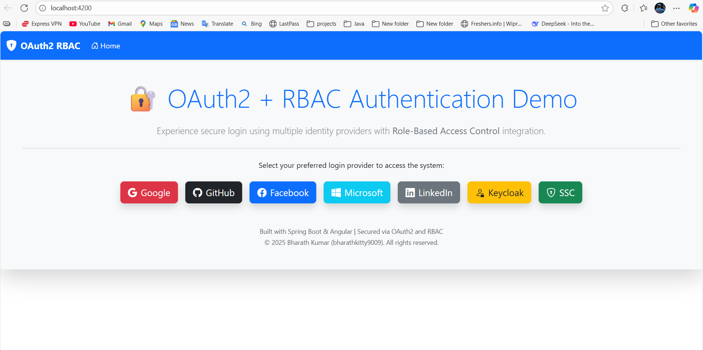
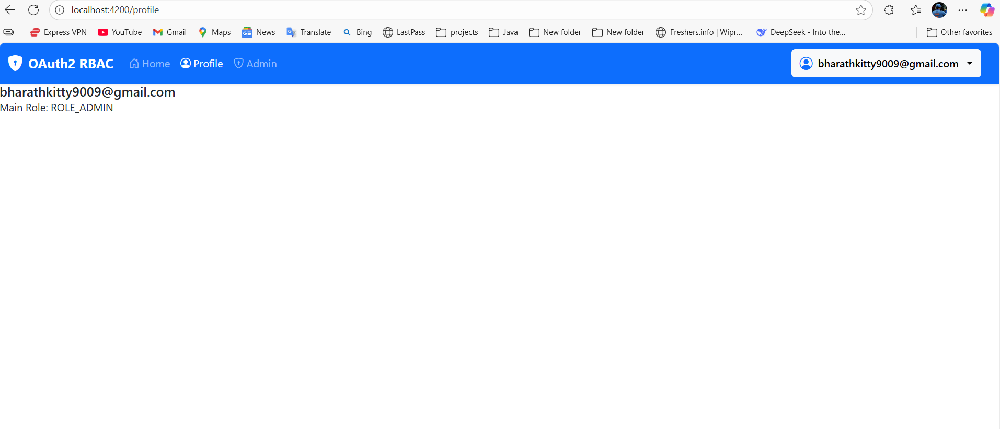

# OAuth RBAC Project

## 🔑 Project Overview
This is a **full-stack OAuth + RBAC project** built with **Spring Boot** backend and **Angular** frontend.  
Users can log in using **OAuth providers (Google, GitHub, Facebook)**, and access pages based on their **role permissions**.

---

## 🛠️ Tech Stack

**Backend:** Spring Boot, Spring Security, JWT, OAuth2, Hibernate, MySQL  
**Frontend:** Angular 16, Bootstrap/Material  
**Authentication Providers:** Google, GitHub, Facebook  
**Other Tools:** Postman, Git, Maven, VS Code

---

## 🎯 Features

- OAuth2 login with multiple providers  
- Role-Based Access Control (Admin/User)  
- JWT authentication for API endpoints  
- Frontend integration with Angular  
- Responsive UI with Bootstrap

---

## 📸 Screenshots
## 📸 Screenshots

**All Authentication Providers**  


**Login with Github**  


**Login with Google**  


**Login with LinkedIn**  



---

## 🚀 How to Run

### Backend
```bash
cd backend
mvn clean install
mvn spring-boot:run
